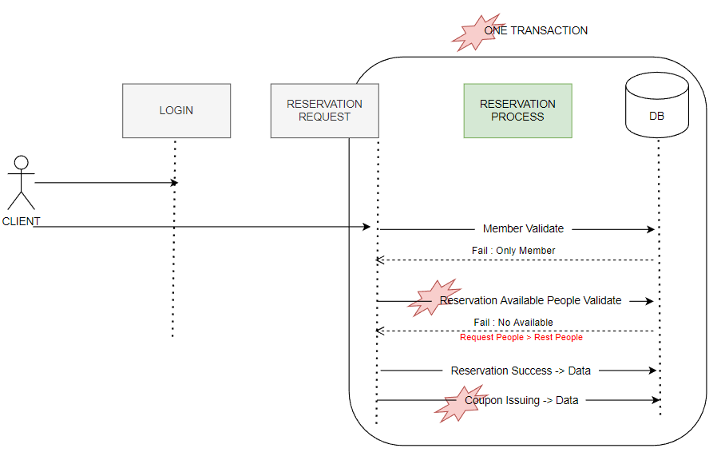

# Redis/Kafka 이용한 대용량 트래픽 예약 및 쿠폰 발급 서비스

[서울 우언 잇츠 3기] 스터디 그룹 '발칙한 Tech Speakers' 연구 주제 결과물   
https://github.com/SeoulWomenIts-TechSpeakers/TechSpeakers
### 💥 무엇이 문제인가
_현재 동기식 서버 아키텍처_

#### 1. 시퀀스 다이어그램

- 요청 이후 호스트에 등록한 재고를 확인함
- 요청 <= 재고 인 경우 예약 체결
- 체결 완료한 요청에 경우 쿠폰 발급 

#### 2. 발생할 수 있는 문제 
- 동시 요청의 경우 재고 업데이트 이전에 재고를 조회 
  - 동시 요청 만큼 재고가 차감되지 않고, 기존에 있는 재고로 Lost Update 문제 발생
- 쿠폰로직이 예약 로직과 같은 트랜잭션에 엮여 있음 
  - 지연 발생 가능 
- 재고 확인 후 재고 차감에 많은 디스크 I/O 발생 

<br>

### ⚒️ 어떻게 해결할까
_대량 트래픽 개선 서버 아키텍처_ 
#### 1. 아키텍처 구조 계획

#### 2. 사용한 기술 스텍
- REDIS 
  - 재고 적재 Look Aside + Write through  캐시 히트 적용
  - 빠른 재고 확인용
- REDISSON 
  - 임계 영역에 대한 LOCK을 적용 동시성 문제 해결 
- KAFKA
  - 즉시 필요하지 않은 비즈니스 로직을 추후에 실행하기 위함 
  - 예약 과정에서의 성능을 높임

<br>

### 🤔 왜 최선일까? 다른 방법은 없을까?
#### REDISSON -> 분산락?
- 현재 아키텍처 구조(WAS 1개/DB 1대) 분산락이 더 적합하나, 분산 DB를 가정으로 REDIS 캐시 서버 선택함
  - 분산락 예) 예약 적재에 @Transactional (propagation requires-new)을 걸고
  - x-Lock 으로 update (현재 칼럼의 값에서 요청 값 차감)
  ```java   
    public void decreaseStock(int stockNumber) {
      isAvailable(stockNumber);
      this.stockNumber -= stockNumber;
    }
  ```

#### REDIS ->  디스크 I/O
- 이 부분도 선택의 문제임. 
  - 실무에선 재고와 상태 테이블을 연결하여 각 상품의 주문마다 상품의 재고 상태를 보고 판매중 일때 재고를 차감
  - 또한 REDIS는 로그인 정보 (자동로그인)나 세션 데이터 확인에서 사용하고 있음 
- 빠른 성능을 위해서 넣은 기능이지만, 적은 트래픽으로 유지된다면 디스크I/O도 적절한 선택임.
- 하지만 확장성을 대비하여 REDIS 를 사용

